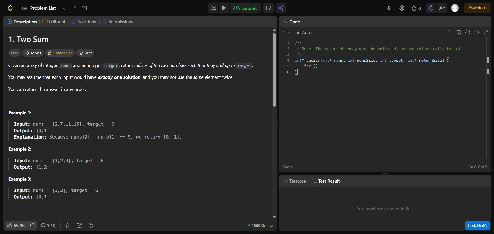

#  CodeHintAI  

  

---

**AI-powered Chrome extension that gives progressive coding hints — not full solutions.**  
Built with a local LLM (Mistral via Ollama) + custom backend for safe hint generation.

---

##  Why I Built This  
Most students struggle while solving coding problems:  
- They either spend hours stuck, **or**  
- They check the full solution too early.

**CodeHintAI** solves this by giving *gradual, structured hints* so learners stay in the problem-solving mindset instead of being spoon-fed answers.

---

##  Features  
###  Progressive Hint Levels  
- **Level 1:** High-level concept  
- **Level 2:** Design idea / approach  
- **Level 3:** Pseudocode-like thinking (still no solutions)  
- **Level 4:** Stepwise outline, but *never code*  

###  Prevents Full Solutions  
Custom filters Strip:  
- Code blocks  
- Return statements  
- Language keywords  
- Line-by-line pseudocode  

###  Works on LeetCode, HackerRank & more  
Automatically extracts:  
- Problem title  
- Problem description  

###  Local & Private  
Uses **Ollama (Mistral)** running completely offline.  
No data leaves your computer.

---

##  Tech Stack  
**Frontend:**  
- Chrome Extension (Manifest v3)  
- HTML, CSS, JavaScript  
- Content Scripts + Popup UI  

**Backend:**  
- Node.js + Express  
- Custom prompt engineering  
- Code-safety filtering  

**AI Model:**  
- Mistral 7B via **Ollama**  
- Locally running at `localhost:11434`  

---

##  Architecture  
Chrome Extension (Popup)
│
▼
Extracts Problem Title + Description
│
▼
POST /generate_hint → Backend (Node.js)
│
▼
LLM Prompt Builder → Ollama (Mistral)
│
▼
Hint Returned → Filtered → Sent Back to Extension

---

## 🔧 Installation (Local Setup)

### 1) Install Ollama  
https://ollama.com/download  
Then pull the model:

### 2) Run backend  
cd server
npm install
npm start

Backend runs at:
http://localhost:3000

### 3) Load extension  
1. Open Chrome → `chrome://extensions`  
2. Enable **Developer mode**  
3. Click **Load unpacked**  
4. Select the `extension` folder  

---

##  How It Works  
1. User opens LeetCode/HackerRank problem  
2. Extension scrapes title + description  
3. User chooses hint level  
4. Backend sends structured prompt to the LLM  
5. Response is filtered so no solutions leak  
6. User gets a safe, progressive hint  

---

##  Example Hint Flow  
**User chooses Level 1:**  
> “Think about what data structure lets you quickly check complements.”

**Level 2:**  
> “A one-pass approach using a hash map might help reduce time complexity.”

**Level 3:**  
> “Try tracking visited values and checking if the complement exists as you iterate.”

---

##  Future Improvements  
- Syntax-highlighted UI  
- Auto-detect coding attempts directly from the editor  
- Support for Codeforces, AtCoder  
- More advanced hint progression  
- Chrome extension publish to Web Store  

---

##  Author  
**Snigdha Routray**  
Feel free to connect on LinkedIn!

---

##  Why This Project Matters  
This project demonstrates:  
- Chrome extension development  
- Backend API development  
- LLM integration with local inference  
- Prompt engineering  
- Clean UI & UX thinking  
- Strong real-world application  

